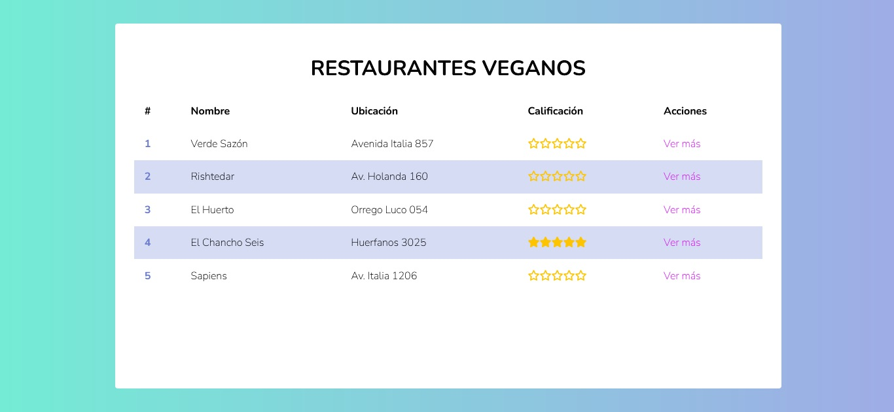

# topRestaurant Veganos
2do proyecto de código facilito.
Se trabajo con HTML, CSS y JavaScript

- Link del proyecto: [Ir al sitio final](https://danielaalcaladaboin.github.io/topRestaurant/)

## Índice

* [1. Introducción](#1-Introducción)
* [2. Imagen final del sitio](#2-Imagen-final-del-sitio)
* [3. Herramientas Utilizadas](#3-Herramientas-de-elaboración)
* [4. Notas](#4-Notas)

## 1. Introducción

Se realiza una tabla con el top 5 de restaurantes Veganos en Santiago de Chile, en dicha tabla podrás encontrar Nombre, dirección, calificación y una síntesis de cada restaurante.

##  2. Imagen final del sitio

En las siguientes imágenes mostraremos nuestro sitio.

* Comenzamos por la pantalla de inicio

* Al dar click en la opción "Ver más" tendrá acceso al resumen de cada restaurante

##  3. Herramientas Utilizadas

* HTML
* CSS
* JavaScript

##  4. Notas

Es el segundo proyecto del Curso Profesional Desarrollo Web de Código Facilito
